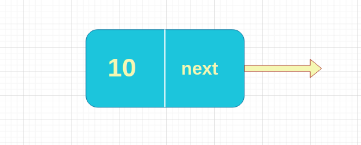
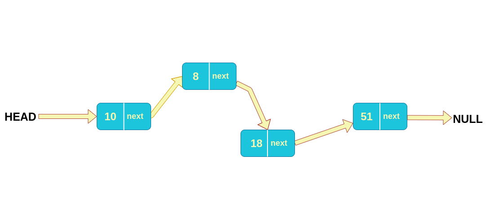
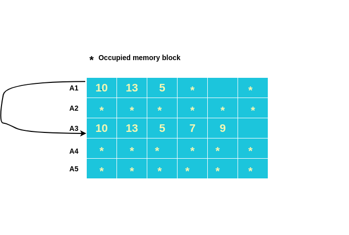
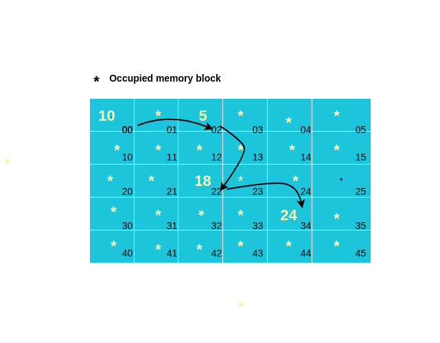

# Linked List 
A linked list is just like a treasure map of [Indiana Jones](https://en.wikipedia.org/wiki/Indiana_Jones)
All the mysterious places have two things in common 
- Ancient artifacts/treasure 
- Clue for the next place 

A simple linked list or singly linked list works like the treasure map. Like a single place of our treasure map , unit of a linked is named as Node.   
A node also consist of two things 
- Data
- Pointer for the next node

The the node at the beginning called head and the last node known as tail . The identifier of last node is, it always points to NULL. 
### Node

### What does a linked list look like ?

### Why do we need linked list when we have array ? 
While working with a list of data we can use array . Then the question arises ,why do we need another data structure (linked list) to do the same ? 
Well, these two data structures don't work like same under the hood so that these have different use cases. 

Array needs continuous memory allocation. It means when we define an array with a certain size, we actually 
define some continuous memory addresses to store elements one by one from the list. 
If we want enlarge the list than before , then we need to allocate another continuous block of memory with the new size and copy all the previous elements in it and then add the new elements.  

On the other hand , linked list doesn't need continuous memory . All it needs an address of  the memory to store a item on the list and a pointer for the next address of the memory. We don't need to find any continuous empty block of memory for linked list . 
If any block is empty we can store list item and point it to the next block. 

